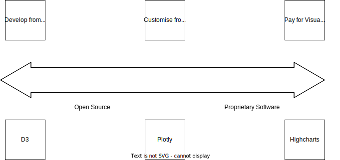
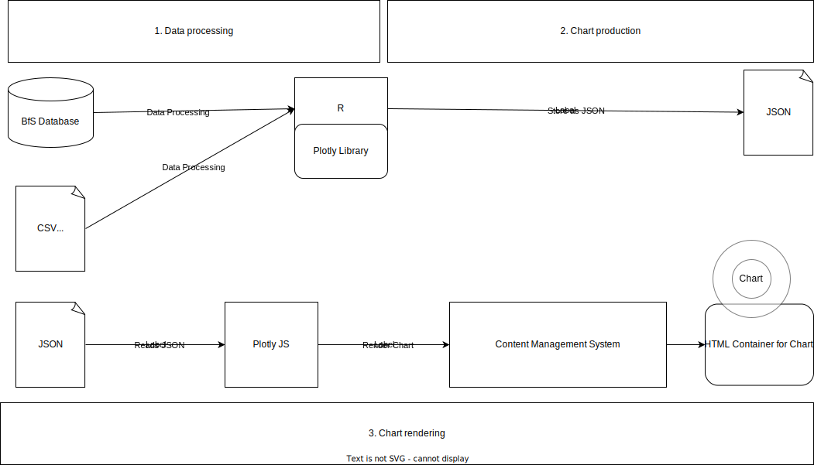

```{r xaringansetup, echo=FALSE, warning=FALSE,message=FALSE}
require(xaringan)
require(xaringanExtra)
xaringanExtra::use_logo(
  image_url = "./images/logo_kt_fb.png"
)
xaringanExtra::use_fit_screen()
xaringanExtra::use_progress_bar(color = "#006FB5", location = "top")
xaringanExtra::use_panelset()
hook_source <- knitr::knit_hooks$get('source')
knitr::knit_hooks$set(source = function(x, options) {
  x <- stringr::str_replace(x, "^[[:blank:]]?([^*].+?)[[:blank:]]*#<<[[:blank:]]*$", "*\\1")
  hook_source(x, options)
})
```

# .center[Starting Point]
- (Interactive) charts = standard product in statistics 

???
- Convey more information; users choose what is relevant
--

- .stylered[Different tools to process and visualise data] vs. .stylegreen[integrated framework]

???

- Traditionally production of web charts split into data processing part in statistical software and chart production in Javascript; requires mastering two tools and programming languages

- Integrated framework with data processing and chart production in same software, in Zug R, and only rendering of chart with Javascript

- Advantage mastering one programming language only; data pipeline process easier to track and understand; maintenance and knowledge transfer; inspect chart before uploading = error detection; faster rendering of chart

--

```{r essential, echo=FALSE, height=675, width= 350}

```


???

- Proprietary software like highcharts takes the burden of the user to have a decent knowledge of Javascript, but you pay for it

- Most Open source software has either limits what it can, or requires developing from scratch like the Javascript D3 library, that means time ressources for mastering D3, good documentation and knwoledge transfer need to be ensured if the maintainer leaves. 

- Probably no issue for cantons like ZUrich with a lot of manpower, but is an issue for smaller cantons

- I labelled the framework I am gonna present you customising from toolkit, because don't build a chart from scratch but from a prebuild toolkit, but one with a lot of options to customise. It is also an open source approach, so we don't pay for pur chart production tool


---

# .center[May I introduce Plotly?]
- Open-Source chart library built on top of D3

???
- before I show you how our charts look on the web, and how to produce them within R, I will briefly introduce you to what Plotly is

- open source chart lirbary built on top of D3, we can use it for free although there exists also premium instance where you would need to pay for

- Essential geometries/chart types available (Line, Bar, Scatter, Sunburst/Pie, Violin/Box Plot, Treemaps, Maps)

- Charts can be combined (subplots, or different shapes in same plot)

- Comes with default interactivity features
--

- Available in different programming languages

???
- Huge advantage is its good implementation in R, which doesn't exist for the most open source javascript charting libnrarires. 
- Plotly is really made for being programmed with different languages, you can use it with Python, R, Javascript, Matlab or Julia. It also allows collaboration of users that have knowledge of different programming languages
--

- Can be used in web-publishing frameworks (e.g. Dash/Shiny)

???
- We can make use of Plotly charts in other facilitating web publishing frameworks like Dash or Shiny that essentially translate Python or R Code to ship around the use of Javascript in web pucliation. 
--

- Can be used in other publications

???
- integration in reports or presentation in formats that support interactivity
- can be a huge upgrade compared to standard static charts in word or pdf
--

- Can translate most 'R ggplots' into Plotly objects

???
- Particularly interesting for R-enthusiasts

---
# .center[Website Statistics Zug]

<a href="https://www.zg.ch/behoerden/gesundheitsdirektion/statistikfachstelle/themen/soziale-sicherheit/sozialversicherungen">Examples Web Charts Statistics Zug</a>

???

now I'm gonna show you how our charts look like on our webpage to illustrate some of Plotl'ys features.

- automatic resizing

- hover

- clickable legend for data selection

- dropdown buttons to filter data or restyle a chart

- excel download button point to an excel file with the data of a chart

- camera button for screenshots

- info button how to interact wiht the chart


---
# .center[An R-oriented framework for producing web charts]

```{r chartproduction, echo=FALSE, out.height="80%", out.width="100%"}

```


???
- So now it comes to show you how our framework looks like in detail and then to show you some code.

- As said, our motto is as much R as possible, as little Javascript as necessary, 

- So we want our data processing and chart production to be done in R, then we want Plotly's Javascript instance only to render the chart that we have produced in R and stored as a JSON file. 

- This is what you see in this sketch of our chart production. We load data from the BFS database directly into R, or load data from our internal web server and process it inR, then we specify and customise the chart with Plotly in R, store it as a JSON file and upload it to a path on the server where our IT hosts the content management of the system. THere, we have stored also a Javascript instance of Plotly.

- Then we need to specify within our content management system an HTML-container in which the chart will be rendered. 

- The only Javascript we then need is to load the JSON file that holds the chart in that particular div, and the client's web browser will then render that chart.


```{r setup,include=FALSE}
library(magrittr)
library(plotly)
knitr::opts_chunk$set(warning = FALSE, message = FALSE) 
# load data
load("./data/daten1.rda")
load("./data/daten2.rda")
load("./data/daten3.rda")
load("./data/daten4.rda")
daten4$Year <- daten4$Year-364#to make x axis label (year-level) better aligned with data points
load("./data/gemeinden.rda")
load("./data/kanton.rda")
```

---

.panelset[
.panel[.panel-name[Plot Example I]

```{r plotlychart,echo=FALSE,eval=TRUE,fig.width=8,fig.height=4.5,dpi=300,out.width="1920px",out.height="1080px"}
plot_ly(
  data = daten1,  #<<
  x = ~ Canton,  #<<
  y = ~ Population,  #<<
  colors = "#006FB5",  #<<
  type = "bar",  #<<
  height = 480,  #<<
  width = 750,  #<<
  customdata = ~ hover,  #<<
  hovertemplate = "%{customdata}<extra></extra>"  #<<
) %>%
  layout(
    title = "Population Swiss Cantons, 2021",
    xaxis = list(categoryorder = "total descending"),
    yaxis = list(title = "", tickformat = ",.0f"),
    bargap = 0.5,
    #autosize = FALSE,
    showlegend = FALSE,
    annotations = list(
      text = "Source: BFS STATPOP",
      showarrow = FALSE,
      x = 0.15,
      y = -0.25,
      xanchor = "right",
      yanchor = "auto",
      xref = "paper",
      yref = "paper",
      xshift = 0,
      yshift = 0
    ),
    margin = list(
      l = 10,
      r = 10,
      t = 50,
      b = 120,
      pad = 5
    )
  ) %>%
  config(displayModeBar = F)
```
]
.panel[.panel-name[Code Example I]


```{r plotlychart,eval=FALSE}
```
]
]

???

- Now I will briefly show you how easily you can make a Plotly chart with some interacctivity features. 

- So the first is a simple bar chart with plotting the population count of the Swiss cantons

- We have a hover with information we have specified, and we can also interactively select data. 

- Maybe I'm interested to compare the population count of Zug only with cantons that have a similar population. We can go into the chart, hold the mouse and then select the data we are interested in and the chart gets resized to that area, so also the y-axis is now changed with new limits. WIth a double click we can switch back to the initial plot


---
.panelset[
.panel[.panel-name[Plot Example Ia]
```{r plotlychartggplot,echo=FALSE,eval=TRUE,fig.height=3.25,fig.width=8}
chart <- ggplot(data = daten1,
                aes(x = reorder(Canton, -Population),
                    y = Population)) +
  geom_bar(stat = "identity",
           fill = "#006FB5",
           width = .66) +
  theme_classic() +
  labs(
    x = "Canton",
    y = "",
    title = "Population, Swiss Cantons, 2021",
    caption = "Source: BFS STATPOP"
  ) +
  scale_y_continuous(labels = scales::comma)

chart

ggplotly(chart,width=600,height=300) %>% #<<
  config(displayModeBar = FALSE)

chart2 <- plotly::ggplotly(chart) %>% plotly::plotly_build()
```
]
.panel[.panel-name[Plot Example Ia]
```{r plotlychartggplot,eval=FALSE,out.width = "100%"}
```
]
]
???
- now you see the exact same chart, but the chart on top is a static ggplot

- the below chart is a plotly plot that has translated the static R ggplot into an interactive plotly chart

- as you can see, the syntax is very easy, you simply make a ggplotly call to translate the ggplot into a plotly object

- However, you can see on the hover information that you would need to customise that to make it a publishable chart.

- You cannot translate all ggplots into plotly objects, but many

---
.panelset[
.panel[.panel-name[Plot Example II]
```{r plotlychartselection,echo=FALSE,eval=TRUE,fig.fullwidth=TRUE}
plot_ly(
  data = daten2,
  x = ~ Year,
  y = ~ Value,
  color = ~ Type, #<<
  colors = c(
    "#4B0082",
    "#BF000A",
    "#FFA500",
    "#006FB5",
    "#808080",
    "#fde725"
  ),
  type = "bar",
  height = 550,
  width = 700
) %>%
  layout(
    title = "Factors of Population Growth, Canton Zug 2000-2021",
    yaxis = list(title = "", tickformat = ",.0f"),
    legend = list(orientation="h"),
    barmode = "relative",
    bargap = 0.5,
    autosize = FALSE,
    annotations = list(
      text = "Source: BFS STATPOP",
      showarrow = FALSE,
      x = 0.15,
      y = -0.4,
      xanchor = "right",
      yanchor = "auto",
      xref = "paper",
      yref = "paper",
      xshift = 0,
      yshift = 0
    ),
    margin = list(
      l = 10,
      r = 10,
      t = 50,
      b = 120,
      pad = 5
    )
  ) %>%
  config(displayModeBar = F)
```
]

.panel[.panel-name[Code Example II]
```{r plotlychartselection,eval=FALSE,out.width="100%"}
```
]
]

???

- so in this stacke bar chart plotting the drivers of population growth in Zug, we have the clickable legend again

- we may want to inspect only the birth which is what we achieve with a double click. or maybe compare births and deaths, so we select now also deaths with a single click. And with a double click we come back to the initial chart.

- As you can see from the code, I didn't need to specify anyhting to have this clickable legend.

---
.panelset[
.panel[
.panel-name[Plot Example III]
```{r plotlychartbutton,eval=TRUE,echo=FALSE,out.width="100%"}
plot_ly(
  data = gemeinden,
  y = ~ Gemeinde,
  x = ~ Inhabitants,
  colors = "#006FB5",
  type = "bar",
  customdata = ~ hover,
  hovertemplate = "%{customdata}<extra></extra>",
  width = 700, height = 500
) %>%
  add_trace(
    data = kanton,
    type = "bar",
    visible = FALSE,
    marker = list(color = "#006FB5")
  ) %>%
  layout(
    title = "Population Canton Zug and Municipalities, 2021",
    xaxis = list(title = "",
                 tickformat = ",.0f"),
    yaxis = list(title = ""),
    bargap = 0.5,
    autosize = FALSE,
    showlegend = FALSE,
    updatemenus = list(#<<
      list(#<<
        x = 1.05,#<<
        y = 1.15,#<<
        xanchor = "left",#<<
        yanchor = "top",#<<
        direction = "down",#<<
        type = "dropdown",#<<
        buttons = list(#<<
          list(#<<
            method = "restyle",#<<
            args = list("visible",#<<
                        c(TRUE, FALSE)),#<<
            label = "Gemeinden"#<<
          ),#<<
          list(#<<
            method = "restyle",#<<
            args = list("visible",#<<
                        c(TRUE, TRUE)),#<<
            label = "Gemeinden & Kanton"#<<
          )
        )
      )
    ),
    annotations = list(
      text = "Source: BFS STATPOP",
      showarrow = FALSE,
      x = 0.15,
      y = -0.25,
      xanchor = "right",
      yanchor = "auto",
      xref = "paper",
      yref = "paper",
      xshift = 0,
      yshift = 0
    ),
    margin = list(
      l = 10,
      r = 10,
      t = 100,
      b = 120,
      pad = 5
    )
  ) %>%
  config(displayModeBar = F)
```
]
.panel[
.panel-name[Code Example III]

```{r plotlychartbutton,eval=FALSE,echo=TRUE}
```
]
]
???
- Now we come to the dropdown events. This chart shows the population of Municipalities in Zug and the Canton. We have two buttons,
one will make us show only the municipalties, and the other one is if we want to compare the canton with the municipalities. 

- That involves a litlte bit more coding bit is still very simple if you compare it to how you would make that with html and javascript

- THe highlighted code lines are responsible for this menu. Essentially, we specify a menu to update the chart and its location, and then what should happen when we select a particualr button, which is now that we make a particular data trace visible or not
---
.panelset[
.panel[
.panel-name[Plot Example IV]

```{r plotlychartslider,echo=FALSE,eval=TRUE}
plot_ly(
  data = daten4,
  x = ~ Year,
  y = ~ Population,
  colors = "#006FB5",
  type = "scatter",
  mode = "lines",
  customdata = ~ hover,
  hovertemplate = "%{customdata}<extra></extra>",
  height=500,
  width=700
) %>%
  layout(
    title = "Population Canton Zug, 2000-2021",
    xaxis = list(title = "",
                 rangeslider = list(type = "date"),#<<
                 rangeselector = list(buttons=list(#<<
                   list(count=10,#<<
                        label="Past 10 years",#<<
                        step="year",#<<
                        stepmode="backward"),#<<
                   list(count=round(#<<
                     lubridate::time_length(#<<
                       difftime(#<<
                         as.Date(max(daten4$Year)),#<<
                         as.Date("2015-01-01")),#<<
                       "years"),#<<
                     digits=0),#<<
                        label="Since 2015",#<<
                        step="year",#<<
                        stepmode="todate"),#<<
                   list(label="All years",#<<
                        step="all")#<<
                 ))),#<<
    yaxis = list(title = "",
                 tickformat = ",.0f"),
    autosize = FALSE,
    annotations = list(
      text = "Source: BFS STATPOP",
      showarrow = FALSE,
      x = 0.15,
      y = -0.25,
      xanchor = "right",
      yanchor = "auto",
      xref = "paper",
      yref = "paper",
      xshift = 0,
      yshift = 0
    ),
    margin = list(
      l = 10,
      r = 10,
      t = 100,
      b = 120,
      pad = 5
    )
  ) %>%
  config(displayModeBar = F)
```
]
.panel[
.panel-name[Code Example IV]

```{r plotlychartslider,eval=FALSE}
```
]
]

???
- finally I show you how to implement a rangeslider and rangeselector

- In this chart, we may be interested in a particular timeline and not the whole data series. 

- Maybe I'm interested how the population has devevloped in the past 10 years, for that we can use thebutton on top.

- Or maybe i'm interested in specific years, so how the population has developed from 2010 to 2015. For that, we can use the rangeslider below and select the data to the area we are interested in. 
---

.panelset[
.panel[
.panel-name[Store JSON]
```{r storeplotlychart,eval=FALSE}
write_plotly <- function(plot, pfad) {
  schreibpfad <- paste0(pfad, ".json")
  base::writeLines(text = plotly:::to_JSON(plot),
                   con = schreibpfad,
                   useBytes = T)
}

write_plotly(chart2, paste0(getwd(), "./data/figures"))
```
]
.panel[
 .panel-name[JSON Structure R]
```{r jsonstructure}
str(chart2)
```
]
]

???
- So how do we come from those charts being made in R to the web charts?

- First, we store the Plotly plot as a JSON file, for that we have written a little function

- This is how the plotly figure looks in R, it's basically a list. You can also see that there is much more in that list than I specified when making the plot because Plotly uses default values whenever the user didn't make a specification.

- Then we upload the JSON file to a server that we can access from our content management system.

---
# .center[Rendering the JSON File]
.panelset[
.panel[
.panel-name[HTML]

```{js htmljavascriptcode,eval=FALSE}
<div id='chart44'></div>#<<

<script>
require.config({
	baseUrl: '/behoerden/gesundheitsdirektion/statistikfachstelle/daten/js/'
});

require(['makeplotlyzg'], function (makeplotlyzg) {
	makeplotlyzg.load({#<<
		number:44,					#<<								
		json_path:"/behoerden/gesundheitsdirektion/statistikfachstelle/daten/themen/themen-08-00-02.json",		#<<
    downloadurl:"/behoerden/gesundheitsdirektion/statistikfachstelle/daten/themen/themen-08-00-02.xlsx"	#<<
	});
})


</script>
```

]
.panel[
.panel-name[Essential Javascript]
```{js jscode, eval=FALSE}
//define Javascript libraries
require.config({
	baseUrl: '/behoerden/gesundheitsdirektion/statistikfachstelle/daten/js/',
	paths: {
		"libs": "libraries/",
		"d3v7":"libraries/d3v7/d3",
		"plotly":"libraries/plotly",
		"locale": "libraries/plotly-locale-de-ch"}});

//load libraries on demand
define(['plotly','d3v7','locale'], function(URI,plotly,d3v7,locale,html2canvas){
return{load: function(args) {
        var number = (typeof args.number == 'undefined') ? 1 : args.number;
        var json_path = (typeof args.json_path == 'undefined') ? "error" : args.json_path;
        var downloadurl = (typeof args.downloadurl == 'undefined') ? "error" : args.downloadurl;
//use data and then plot        
var daten = d3v7.json(json_path + '?' + Math.floor(Math.random() * 1000)).then(function(data){
 plotly.newPlot('chart'+number, data.x.data,data.x.layout,config);
});

}
};
});
```
]


.panel[
.panel-name[Javascript]
```{js fulljs,eval=FALSE}
require.config({
	baseUrl: '/behoerden/gesundheitsdirektion/statistikfachstelle/daten/js/',
	paths: {
		"libs": "libraries/",
        "urijs":"libraries/URI",
		"d3v7":"libraries/d3v7/d3",
		"plotly":"libraries/plotly",
        "html2canvas":"libraries/html2canvas",
		"locale": "libraries/plotly-locale-de-ch"
    }
});


var stylesheets = "/behoerden/gesundheitsdirektion/statistikfachstelle/daten/css/statistik.css"
var $head = $("head");
$head.append("<link rel=\"stylesheet\" type=\"text/css\" href=\"" + stylesheets + "\">");
$('body').css('background-color','transparent');
//makecontainers funktion erstellt innerhalb eines div's auf der webseite welches dem muster chart + Nummer X folgt, weitere div's in welche Metadaten und der Chart abgefüllt wird
    function makecontainers(number) {
    if($("#chart" + number + " > div.title" + number).length === 0){
        $("#chart" + number).prepend( "<div id='title" + number + "' class='title'></div>" );
    }
    if($("#chart" + number + " > div.subtitle" + number).length === 0){
        $("#chart" + number + " > div.title").after( "<div id='subtitle" + number + "' class='subtitle'></div>" );
    } 
    if($("#chart" + number + " > div.explanation" + number).length === 0){
        $("#chart" + number + " > div.subtitle").after( "<div id='explanation" + number + "' class='explanation style='display: none; font-size: 12px;'></div>" );
    }
    if($("#chart" + number + " > div.chartarea" + number).length === 0){
        $("#chart" + number + " > div.explanation").after("<div id='chartarea" + number + "' class='chartarea'></div>" )
    }
    if($("#chart" + number + " > div.source" + number).length === 0){
        $("#chart" + number + " > div.chartarea").after("<div id='source" + number + "' class='source'></div>" )
    }
}
//funktion testet ob ein file heruntergeladen werden kann
function canDownloadFile(url, callback)
{
  var http = new XMLHttpRequest();
  http.open('HEAD', url);
  http.onreadystatechange = function() {
    if (http.readyState === XMLHttpRequest.DONE) {
      callback(http.status);
    }
  };

  http.send();
}

//function um canvas in bild zuv erwnalden: https://github.com/SuperAL/canvas2image/blob/master/canvas2image.js

define(['urijs/URI','plotly','d3v7','locale','html2canvas'], function(URI,plotly,d3v7,locale,html2canvas){
return{
    load: function(args) {
        var number = (typeof args.number == 'undefined') ? 1 : args.number;
        var json_path = (typeof args.json_path == 'undefined') ? "error" : args.json_path;
        var downloadurl = (typeof args.downloadurl == 'undefined') ? "error" : args.downloadurl;
        //container erweitern für meta und plot div
        makecontainers(number);

//function lädt file herunter falls can Download file funktion korrekt, ansonsten dialogbox
        var canDownloadCallback = function (statusCode) {
            if (statusCode === 200) {
              window.open(downloadurl,'_parent');
            } else {
              $("<div>Entschuldigen Sie bitte die Unannehmlichkeit, für diese Graphik existiert leider noch keine Excel-Datei. Sie können uns per E-Mail darüber informieren, wenn Sie auf 'Email' klicken. Andernfalls klicken Sie bitte auf Abbrechen und kommen damit zurück zur Webseite.</div>").dialog({
                  title: "Fehler: keine Excel-Datei vorhanden",
                  autoOpen: true,
                  width: 600,
                  buttons: {
                      "Email": function emailForm(){
                      var email = "info@statistik.com";
                      var mailto_link = 'mailto:'+email;
                      window.location.href =mailto_link;
                      },
          
                      "Abbrechen": function() {
                          $(this).dialog("close");
                      }
                  }
              });
            }
          }
//Funktion um uri zu verändern
          if (typeof uri == 'undefined') { uri= new URI(window.location.href)};


        //konfiguration plotly
        //excel button für plotly modebar definieren
var excelsvg={'width': 500,'height': 600,'path': 'M64 0C28.7 0 0 28.7 0 64V448c0 35.3 28.7 64 64 64H320c35.3 0 64-28.7 64-64V160H256c-17.7 0-32-14.3-32-32V0H64zM256 0V128H384L256 0zM155.7 250.2L192 302.1l36.3-51.9c7.6-10.9 22.6-13.5 33.4-5.9s13.5 22.6 5.9 33.4L221.3 344l46.4 66.2c7.6 10.9 5 25.8-5.9 33.4s-25.8 5-33.4-5.9L192 385.8l-36.3 51.9c-7.6 10.9-22.6 13.5-33.4 5.9s-13.5-22.6-5.9-33.4L162.7 344l-46.4-66.2c-7.6-10.9-5-25.8 5.9-33.4s25.8-5 33.4 5.9z'};
// info button für plotly modebar definieren
var infosvg = {'width':500,'height':600,'path':'M256 512c141.4 0 256-114.6 256-256S397.4 0 256 0S0 114.6 0 256S114.6 512 256 512zM216 336h24V272H216c-13.3 0-24-10.7-24-24s10.7-24 24-24h48c13.3 0 24 10.7 24 24v88h8c13.3 0 24 10.7 24 24s-10.7 24-24 24H216c-13.3 0-24-10.7-24-24s10.7-24 24-24zm40-144c-17.7 0-32-14.3-32-32s14.3-32 32-32s32 14.3 32 32s-14.3 32-32 32z'};
//kamera button für modebar defiunieren
var photosvg = {'width':500,'height':600,'path': 'M149.1 64.8L138.7 96H64C28.7 96 0 124.7 0 160V416c0 35.3 28.7 64 64 64H448c35.3 0 64-28.7 64-64V160c0-35.3-28.7-64-64-64H373.3L362.9 64.8C356.4 45.2 338.1 32 317.4 32H194.6c-20.7 0-39 13.2-45.5 32.8zM256 192a96 96 0 1 1 0 192 96 96 0 1 1 0-192z'};

//plotly configuration definieren: beim excel download müssen wir noch einen catch error falls ressource nicht gefunden wird einbauen, das jetzige funktioniert nicht
var config = {
modeBarButtonsToAdd: [{name: 'Excel Datei Herunterladen',
icon: excelsvg,
click: function(){ 
    canDownloadFile(downloadurl, canDownloadCallback);
}},
{name: 'Information',
title: 'Klicken Sie für Informationen, wie mit der Graphik interagiert werden kann',
icon: infosvg,
click: function() { 
    if ($(".explanation" ).is(":visible")==true){$(".explanation").hide();} else if ($(".explanation" ).is(":hidden")==true){$(".explanation").show();}}
},
{name:'Graphik herunterladen',
icon: photosvg,
click: function(){
    var captureElement = $("#chart"+number)[0] // Select the element you want to capture. Select the <body> element to capture full page.
    //document.body.style.cursor = 'wait';
    //document.style.cursor = "wait";
    //setTimeout('document.body.style.cursor = "default"', 1500);

//wait animation:
$("body").css("cursor", "wait");
d3v7.select('.cursor-crosshair').style('cursor', 'wait');
d3v7.select('.cursor-pointer').style('cursor', 'wait')

    html2canvas(captureElement,{
        ignoreElements: function(element){//test ob modebar hide auch dazu führt das html2canvas das popup ignoriert was aus modebar heruas kommt (source: https://stackoverflow.com/questions/20590104/how-to-remove-certain-elements-before-taking-screenshot)
                if(element.classList.contains('modebar')){
                    return true;
                }
        }
    })
        .then(canvas => {
          
            canvas.style.display = 'none'
            document.body.appendChild(canvas)
            return canvas
        })
        .then(canvas => {
            var image = canvas.toDataURL('image/png').replace('image/png', 'image/octet-stream')
            var a = document.createElement('a')
            a.setAttribute('download', 'my-image.png')
            a.setAttribute('href', image)
            a.click()
            canvas.remove()
            $("body").css("cursor", "default");
            d3v7.select('.cursor-crosshair').style('cursor', 'default');
d3v7.select('.cursor-pointer').style('cursor', 'default')
            //d3v7.selectAll('g.draglayer').style('cursor', 'default');
            //$("div").css('cursor','default');
          
        })
}

}
],
displayModeBar: true,
displaylogo: false,
responsive : true,
 locale: "dech",
modeBarButtonsToRemove: ["hoverclosest","hovercompare","zoom2d","lasso2d","pan2d","select2d","zoomIn2d","zoomOut2d","autoScale2d","resetScale2d","toImage","resetSankeyGroup"]
};

        //Daten einlesen

			var daten = d3v7.json(json_path + '?' + Math.floor(Math.random() * 1000)).then(function(data){

                //populate containers with meta information
                $("#title"+number).html(data.anno.title);
                $("#subtitle"+number).html(data.anno.subtitle);
                let erklaerung = '<p >Mit einem einfachen Klick auf einen Legendeneintrag in der Graphik können Sie die jeweilige Datenreihe ein- oder ausblenden. Per Doppelklick auf einen Legendeneintrag werden alle anderen Datenreihen ein- oder ausblendet.</p>' ;
                $("#explanation" + number).append(erklaerung);
                $(".explanation").hide();
                $("#source" +  number).html(data.anno.source);

                if(data.anno.description.length >0){
                    if($("#chart" + number + " > div.description" + number).length === 0){
                        $("#chart" + number + " > div.chartarea").after("<div id='description" + number + "' class='description'></div>" );
                        $("#description" + number).html(data.anno.description);
                    }
                }
//plotly locale registrieren, ist ggf. überflüssig?
//"undefined" == typeof Plotly ? (window.PlotlyLocales = window.PlotlyLocales || [], window.PlotlyLocales.push(locale)) : Plotly.register(locale);

                plotly.newPlot('chartarea'+number, data.x.data,data.x.layout,config);
                d3v7.select('.cursor-crosshair').style('cursor', 'default');
                d3v7.select('.cursor-ns-resize').style('cursor', 'default');
                d3v7.select('.cursor-pointer').style('cursor', 'default');
                //d3v7.selectAll('g.draglayer').style('cursor', 'default');
                //d3v7.selectAll('g.draglayer').style('cursor', 'default');

            });

}
};
});

```
]

]

???
1. Panel: then we specify an html container in our content management system, and let javascript render the specified chart in it.

2. Panel:  the essential Javascript is boiled down to this: we need to specify the libraries we need, load them on demand, load the data specified in the HTML-container we have seen before and plot it in that container.  

3. Panel: This is the full Javascript code where we have also customised and stanrddised quite some things. We could have done this in R as well, but if you use other Javascript libraries, for example for makng a screenshot of the chart, it is easier to make that work in Javascript itself.

---
# .center[Advanced customisation]

.panelset[
.panel[
.panel-name[Meta]
```{r meta}
plotly_meta <- function(p,
                        title=titel,
                        subtitle=untertitel,
                        source=quelle,
                        description=beschreibung,
                        chart=chartnumber) {
  #adding annotations
  anno <- list("anno"=list("title" = {{title}},
               "subtitle"={{subtitle}},
               "description"={{description}},
               "source"=paste0("Quelle: ",{{source}})
  )
  )
  p <- c(p,anno)
}
```
]
.panel[
.panel-name[Standard Layout]
```{r standardlayout,eval=FALSE}
plotly_zg <-
  function(chart,
           legend = TRUE,
           legendposition = "horizontal",
           xaxistitle = "",
           yaxistitle = "",
           legendtitle = "",
           description = FALSE,
           secondyaxis = FALSE,
           secondyaxistitle = "") {
    if (legendposition == "horizontal") {
      legend.position <- "h"
      x.anchor.position = "left"
    } else if (legendposition == "vertical") {
      legend.position == "v"
      x.anchor.position = "auto"
    } else{
      print("Legend position not yet defined.")
    }
    if (secondyaxis == TRUE) {
      second.yaxis.title = secondyaxistitle
    }
    if (legend == TRUE && legend.position == "horizontal") {
      legendbelowplot = TRUE
    } else{
      legendbelowplot = FALSE
    }
    if (nchar(xaxistitle) == 0 &&
        description == FALSE && legendbelowplot == FALSE) {
      margin.space = list(t = 40,
                          b = 50,
                          l = 10,
                          r = 10)
    } else{
      margin.space = list(t = 40,
                          b = 75,
                          l = 10,
                          r = 10)
    }
    
    plotly::layout(
      p = chart,
      hoverlabel = list(align = "left"),
      #hoverlabel left aligned
      separators = ".'",
      #zahlenformatierung
      paper_bgcolor = "rgba(252,252,252,1)",
      #background color stimmt noch nicht, wird hier für outside plot area gestetzt
      plot_bgcolor = "rgba(252,252,252,1)",
      #color für plot area
      dragmode = FALSE,
      #stellt aus das plot zoombar ist, was auf mobile device ein problem ist da mn dann nicht mehr scrollen kann und im plot festsitzt
      font = list(family = "Arial", size = 12),
      #schrift und grösse für plot
      legend = list(
        bgcolor = "rgba(252,252,252,1)",
        #legenden hintergrund
        text = legendtitle,
        #title der legende, kommt per default aus "titel" objekt inR, andernfalls im befehl manuell spezifizieren
        orientation = legend.position,
        #horizontale ausrichtung
        xanchor = x.anchor.position,
        #legende wird linksbündig geankert
        font = list(family = "Arial", size = 12),
        #legendenschrift
        title = list(font = list(family = "Arial", size = 12))#muss nochmal fpr titel der legende gemacht werden da diese sonst standardmössig 10% grösser ist als legenden items
      ),
      margin = margin.space,
      #margin der outside plot area vor allem unterhalb erhöht, damit legendensetzung horizontal genug platz um nicht x achsen werte zu überlappen
      xaxis = list(
        title = xaxistitle,
        #title der x achse sofern gesetzt
        showgrid = FALSE,
        #wir wollen keine vertical gridlines
        linecolor = "black",
        #schwarze axenlinien
        ticklen = 7.5,
        #length of ticks
        fixedrange = TRUE
      ),
      #fixedrange nötig weil sonst problem auf mobile mit ungewollter plotvergrösserung
      if (secondyaxis == TRUE)
        yaxis2 = list(
          overlaying = "y",
          side = "right",
          title = second.yaxis.title,
          fixedrange = TRUE,
          rangemode = "tozero"
        ),
      yaxis = list(
        title = yaxistitle,
        #titel der yachse sofern gewünscht
        if (secondyaxis == TRUE)
          rangemode = "tozero",
        linecolor = "black",
        #schwarze axenlinien
        ticklen = 7.5,
        #length of ticks
        fixedrange = TRUE
      )#siehe xaxisttile kommentar
    ) %>%
      plotly::plotly_build()
  }

    
```
]
.panel[
.panel-name[Modebar]
```{js plotlyconfiguration,eval=FALSE}
// konfiguration plotly buttons:
// excel button für plotly modebar definieren
var excelsvg = {
  'width':500, 'height':600, 'path':'M64 0C28.7 0 0 28.7 0 64V448c0 35.3 28.7 64 64 64H320c35.3 0 64-28.7 64-64V160H256c-17.7 0-32-14.3-32-32V0H64zM256 0V128H384L256 0zM155.7 250.2L192 302.1l36.3-51.9c7.6-10.9 22.6-13.5 33.4-5.9s13.5 22.6 5.9 33.4L221.3 344l46.4 66.2c7.6 10.9 5 25.8-5.9 33.4s-25.8 5-33.4-5.9L192 385.8l-36.3 51.9c-7.6 10.9-22.6 13.5-33.4 5.9s-13.5-22.6-5.9-33.4L162.7 344l-46.4-66.2c-7.6-10.9-5-25.8 5.9-33.4s25.8-5 33.4 5.9z'
}

// info button für plotly modebar definieren
var infosvg = {
  'width':500, 'height':600, 'path':'M256 512c141.4 0 256-114.6 256-256S397.4 0 256 0S0 114.6 0 256S114.6 512 256 512zM216 336h24V272H216c-13.3 0-24-10.7-24-24s10.7-24 24-24h48c13.3 0 24 10.7 24 24v88h8c13.3 0 24 10.7 24 24s-10.7 24-24 24H216c-13.3 0-24-10.7-24-24s10.7-24 24-24zm40-144c-17.7 0-32-14.3-32-32s14.3-32 32-32s32 14.3 32 32s-14.3 32-32 32z'
}

// kamera button für modebar defiunieren
var photosvg = {
  'width':500, 'height':600, 'path':'M149.1 64.8L138.7 96H64C28.7 96 0 124.7 0 160V416c0 35.3 28.7 64 64 64H448c35.3 0 64-28.7 64-64V160c0-35.3-28.7-64-64-64H373.3L362.9 64.8C356.4 45.2 338.1 32 317.4 32H194.6c-20.7 0-39 13.2-45.5 32.8zM256 192a96 96 0 1 1 0 192 96 96 0 1 1 0-192z'
}


// plotly configuration definieren:
var config = {
  modeBarButtonsToAdd:[{
    name:'Excel Datei Herunterladen',
    icon:excelsvg,
    click:function() {
      canDownloadFile(downloadurl, canDownloadCallback)
      
    }
  },
  {
    name:'Information',
    title:'Klicken Sie für Informationen, wie mit der Graphik interagiert werden kann',
    icon:infosvg,
    click:function() {
      if ($(".explanation").is(":visible") == true) {
        $(".explanation").hide()
      } else if ($(".explanation").is(":hidden") == true) {
        $(".explanation").show()
      }
    }
  },
  {
    name:'Graphik herunterladen',
    icon:photosvg,
    click:function() {
      var captureElement =$("#chart"+number)[0] /  / Select the element you want to capture. Select the <
        body > element to capture full page.$("body").css("cursor", "wait")
      
      d3v7.select('.cursor-crosshair').style('cursor', 'wait')
      
      d3v7.select('.cursor-pointer').style('cursor', 'wait')
      html2canvas(captureElement, {
        ignoreElements:function(element) {
          /  / test ob modebar hide auch dazu führt das html2canvas das popup ignoriert was aus modebar heruas kommt (
            source:https: /  / stackoverflow.com / questions / 20590104 / how - to -
              remove - certain - elements - before - taking - screenshot
          )
          if (element.classList.contains('modebar')) {
            return true
            
          }
        }
      })
      .then(canvas => {
        canvas.style.display = 'none'
        document.body.appendChild(canvas)
        return canvas
      })
      .then(
        canvas => {
          var image = canvas.toDataURL('image/png').replace('image/png', 'image/octet-stream')
          var a = document.createElement('a')
          a.setAttribute('download', 'my-image.png')
          a.setAttribute('href', image)
          a.click()
          canvas.remove()$("body").css("cursor", "default")
          
          d3v7.select('.cursor-crosshair').style('cursor', 'default')
          
          d3v7.select('.cursor-pointer').style('cursor', 'default')
        }
        }
    ],
  displayModeBar:true,
  displaylogo:false,
  responsive:true,
  locale:"dech",
  modeBarButtonsToRemove:["hoverclosest", "hovercompare", "zoom2d", "lasso2d", "pan2d", "select2d", "zoomIn2d", "zoomOut2d", "autoScale2d", "resetScale2d", "toImage", "resetSankeyGroup"]
  }
  
```
]

]

???
1. Panel: Now we have some advanced cusotmisations that allow us to produce our charts more parsimoniuously
- first, we attach some meta data to each plot, and the Full Javascript you have seen before specifies us separate html containers for the title, subtitle, source and description of a chart.

2. Panel:
-Second we have a standard layout that we have customised in R. We basically lay this over each chart to customise the appearance. That makes the R-code you have seen in the examples before superfluous where I had to specify layout options in the plotly call.

3. Panel:
-finally this is how we have configured the modebar above the chart. This is what you have seen at the beginning on our webpage where we could download the excel or a screenshot from the chart, or had the info button 
---
# .center[Summary]
.pull-left[
## .center[Pro]
- Production of interactive web charts in R
]

???
- I will end with a short pro and contra list
--

.pull-right[
## .center[Con]
- Plotly has 'buggy' features requiring workarounds
]

???
-work arounds required for advanced customisation
-for example the mouse selection of a specific area in a chart doesn't work well on mobile phones

--

.pull-left[
- Open soure, steep learning curve
]

--

.pull-right[
- Documentation could be improved
]

--

.pull-left[
- Quick output, benefits for other publications
]

--

.pull-right[
- Not superior to D3 or highcharts
]
